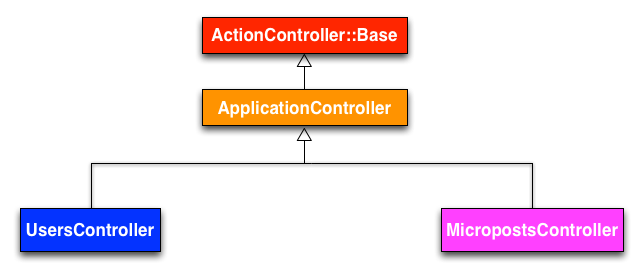

# Self-Notes on Rails

[Rails Important Gotchas](https://betterexplained.com/articles/intermediate-rails-understanding-models-views-and-controllers/)

- [Self-Notes on Rails](#self-notes-on-rails)
- [Rails Big Picture](#rails-big-picture)
  - [Sinatra Basics](#sinatra-basics)
    - [Views Folder: HTML &amp; Forms](#views-folder-html-amp-forms)
  - [The ROR Hartl Tutorial: TOY App](#the-ror-hartl-tutorial-toy-app)
    - [purpose of tutorial](#purpose-of-tutorial)
    - [basic steps using rail's generators](#basic-steps-using-rails-generators)
      - [MVC Overview using One Model](#mvc-overview-using-one-model)
  - [HTTP Related info](#http-related-info)
  - [Understanding URL Components](#understanding-url-components)
  - [APIs](#apis)
  - [Cookies: allowing HTTP requests to have some state](#cookies-allowing-http-requests-to-have-some-state)
    - [Cookie Uses](#cookie-uses)
    - [Authentication](#authentication)
  - [Deployment (Heroku)](#deployment-heroku)
    - [Instances and Traffic](#instances-and-traffic)
    - [Heroku Domains and Naming](#heroku-domains-and-naming)
    - [Addons](#addons)
  - [Warmup Project: RestClient](#warmup-project-restclient)
  - [skipped the testing stuff, no time :( will get back to it when i finally get stuck and can't do anything elsewhere](#skipped-the-testing-stuff-no-time--will-get-back-to-it-when-i-finally-get-stuck-and-cant-do-anything-elsewhere)
  - [Hartl ROR Tutorial Chapter 3: Static Pages](#hartl-ror-tutorial-chapter-3-static-pages)
  - [Routing](#routing)
    - [Root Route](#root-route)
    - [RESTful Routes](#restful-routes)
    - [Rails Way to Write Restful Routes (handly helper method, Rails Magic)](#rails-way-to-write-restful-routes-handly-helper-method-rails-magic)
    - [Rails Routes and Route Helpers](#rails-routes-and-route-helpers)
      - [Controller Namespaces and Routing](#controller-namespaces-and-routing)
    - [Nested Resources! v impt for belongs and such relationships](#nested-resources-v-impt-for-belongs-and-such-relationships)
    - [Shallow Nesting: how to avoid having too many levels of nesting:](#shallow-nesting-how-to-avoid-having-too-many-levels-of-nesting)
    - [Routing Concerns](#routing-concerns)
    - [Creating Paths and URLs from Objects](#creating-paths-and-urls-from-objects)
    - [More RESTful actions (impt for addidional resource routes)](#more-restful-actions-impt-for-addidional-resource-routes)
      - [Member Routes](#member-routes)
      - [Collection Routes](#collection-routes)
    - [Naming Routes](#naming-routes)
    - [Constraints! reread this pls](#constraints-reread-this-pls)
    - [Routes go to Controller Actions](#routes-go-to-controller-actions)
  - [Controllers](#controllers)
    - [Naming is important](#naming-is-important)
    - [Rendering vs Redirecting](#rendering-vs-redirecting)
      - [Multiple Rendering and Redirecting: multiple render error](#multiple-rendering-and-redirecting-multiple-render-error)
    - [Parameters](#parameters)
      - [Hash and Array Parameters](#hash-and-array-parameters)
      - [JSON parameters](#json-parameters)
      - [Routing Parameters](#routing-parameters)
      - [default_url_options](#defaulturloptions)
      - [Params and Strong Params](#params-and-strong-params)
        - [Strong Parameters (kiv for later)](#strong-parameters-kiv-for-later)
    - [Flash](#flash)
      - [Render vs Redirect:](#render-vs-redirect)
  - [Views](#views)
    - [Layouts](#layouts)
    - [Preprocessors](#preprocessors)
      - [How Preprocessors work](#how-preprocessors-work)
    - [View Partials](#view-partials)
      - [Passing Local Variables to Partials](#passing-local-variables-to-partials)
      - [Implicit Partials](#implicit-partials)
    - [Helper Methods called from within a view](#helper-methods-called-from-within-a-view)
      - [#link_to](#linkto)
      - [Asset Tags](#asset-tags)
      - [Forms Helpers](#forms-helpers)
  - [Asset Pipeline](#asset-pipeline)
  - [Active Record Basics](#active-record-basics)
  - [Forms and Authentication](#forms-and-authentication)
  - [Advanced Forms and Active Record](#advanced-forms-and-active-record)
  - [API, Mailers and Advanced Topics](#api-mailers-and-advanced-topics)

I really am behind schedule and may not have enough time. Just gonnna put links here instead.

Basically, the **Rails Guides** are your gods.

# [Rails Big Picture](https://stackoverflow.com/questions/5205002/summary-of-ruby-on-rails-fundamental-concepts)


- naming convention

  - Model: **singular** (e.g. `Resturant`)
    - `ActiveRecord` methods, linked to the model, so are **singular**
      - e.g. `Restural.all`, `Restaurant.find(params[:id])`
  - Associations: has_many (**plural**) and belongs_to(**singular**):

    ```ruby
    class Restaurant < ActiveRecord::Base
    has_many :reviews
    end

    class Review < ActiveRecord::Base
    belongs_to :restaurant
    end
    ```

  - Routes
    - Resources are **plural** :
      `resources :restaurants`
    - Route Helpers:
      - `index`: **plural** `restaurants_path`
      - `show`: **singular** because we are showing just one element, it needs the element inside paranthesis (`restaurant_path(@restaurant)`)
      - `new`: **singular** `new_restaurant_path`
        Controller: **plural** (e.g. `Restaurants`)
  - Table in the DB: **plural** (e.g. `restaurants`)
  - URLs: **plural** (e.g. `/restaurants, /restaurants/:id, /restaurants/new`)

## Sinatra Basics

- [Use Sinatra Readme for reference, there's literally everything here](http://sinatrarb.com/intro.html)

- [Ruby Monstas Sinatra Guide. Something I actually managed to understand](http://webapps-for-beginners.rubymonstas.org/sinatra/dsl.html)

* Sinatra is a **_Domain Specific Language (DSL)_**: a piece of code or library that provides classes and methods that allow us to “speak about them”, or implement them, in the form of code.

  - the domain here is

* like a bare bones version of Rails, helps reduce the Rails learning curve
* doesn't create the file structure for you
* learning aim:

  - how to set up routes
  - organizing views

- note: sinatra server file changs are not auto reloaded, so need to stop and restart the server, or set up the sinatra reloader:
  - `gem install sinatra-contrib` and add a require statement for the reloader

### Views Folder: HTML & Forms

covered:

- erb injection
- debugging using params method

- mkdir `views`

- rendering html and using erb in html templates, learning point is how the call is made e.g.

  ```ruby
  get '/' do
  erb :index, :locals => {:number => generate_number}
  #   "render the ERB template named index and
  #   create a local variable for the template named number which has the same
  #   value as the generate_number meethod's return from this server code."
  end
  ```

- form generation. submission of the form changes the URL to reflect the input done via the form

- **for debugging, use `throw params.inspect`** to analyse what the data looks like inside the server
  - if `params`method reutrns Ruby hash like so: `uncaught throw "{\"guess\"=>\"26\"}"`, then if we write `params["guess"]`, we should get back the value of that key...

## [The ROR Hartl Tutorial: TOY App](https://www.learnenough.com/ruby-on-rails-4th-edition-tutorial/toy_app)

### purpose of tutorial

- to use the **_scaffold generators_** that Rails offers and then to go beyond the utilization of scaffolds
- see the REST architecture favoured by Rails

Details and Planning about the App:

- users
- microposts (twitter like)

* just deploy asap so can run the server and use the changes to debug and lead you through

### basic steps using rail's generators

1. add `hello` action (method) to Application Controller at `app/controllers/application_controller.rb`
2. Set root route at `config/routes.rb`
3. deploy onto heroku
4. create data model, a representation of the structures needed by our app
   - i.e. the table and fields, as well as what types the fields will be of

**Toy Model for Users:**
  - the table name (`users`)and fields `id`, `name`, `email`
  - 
**Toy Model for Microposts:**
  - the table name `microposts` has field `id` and `content` and `user_id`

5. Implement the ***Users model*** along with a web interface to that model. Collectively, this is called the **_Users Resource_**
   - these objects have CRUD actions that can be done, via HTTP protocol
   - note that resources are like "things" in your database or data model
  
6. Migrate database (since the model, and hence the table was generated) to ***update the database with a data model***. note that legacy apps used `rake` to do the db migration, after rails 5, we use `rails` instead. 
  Rake is basically Ruby's make


  #### MVC Overview using One Model

  

1. The browser issues a request for the /users URL.
2. Rails routes /users to the index action in the Users controller.
3. The index action asks the User model to retrieve all users (User.all).
4. The User model pulls all the users from the database.
5. The User model returns the list of users to the controller.
6. The controller captures the users in the @users variable, which is passed to the index view.
7. The view uses embedded Ruby to render the page as HTML.
9. The controller passes the HTML back to the browser.3


[Another Explanation for MVC](https://betterexplained.com/articles/intermediate-rails-understanding-models-views-and-controllers/)

- Controller: 
  - follows RESTful architectural design (Representational State Transfer), where most application components (such as users and microposts) are modeled as resources that can be created, read, updated, and deleted—operations that correspond both to the CRUD operations of relational databases and to the four fundamental HTTP request methods: `POST`, `GET`, `PATCH`, and `DELETE`.
  - all the controllers inherit from `ApplicationController` class  
  - contains a collection of ***related actions***
    - these actions can render pages, but not necessarily 
      - you may have different actions corresponding to the same URL. Just means that the HTTP method is different
        e.g. `update` and `show` both point to URL `/users/1` but diff request method
    - purpose: modify users in the database

    ```ruby
    #  schematic of a controller, e.g. for users controller at: app/controllers/users_controller.rb
    class UsersController < ApplicationController
      .
      .
      .
      def index
        .
        .
        .
      end

      def show
        .
        .
        .
      end

      def new
        .
        .
        .
      end

      def edit
        .
        .
        .
      end

      def create
        .
        .
        .
      end

      def update
        .
        .
        .
      end

      def destroy
        .
        .
        .
      end
    end
    ```
10. Generate the model for Microposts using the scaffolding
11. Add Validations to models:
    1.  character length validation (update the model's file `app/models/micropost.rb`)
12. Write out the ***associations*** between different data models
    - rails, using **ActiveRecord** can infer the associates with the various data models

## [HTTP Related info](https://code.tutsplus.com/tutorials/http-the-protocol-every-web-developer-must-know-part-1--net-31177)

- One key component to pay attention to is the fact that the request and response both have header and (usually) body components. The header contains information about the request or response itself (meta data), including which website to send or return to and what the status of the response is. The body of the request can contain things like data submitted by a form or cookies or authentication tokens while the response will usually contain the HTML page you’re trying to access.
- The other key component is that each request uses one of four main “verbs” – GET, POST, PUT, and DELETE. These days, you almost only see GET and POST requests (even if you’re trying to do a delete of something they usually fake it using a POST request), but it’s important to understand the difference between the verbs.

## [Understanding URL Components](https://www.mattcutts.com/blog/seo-glossary-url-definitions/)

- protocol
- hostname
  - subdomain name
  - domain name
- TLD
  - SLD
- Port (if 80, can just leave out since it's standard)
- Path : typically to a file or location on the webserver 
- URL parameters:
  - separated by `&`
  - literally parameter name with value
- Fragment/Named Anchor: 
  - used to refer to an internal section within a webdocument (skip-to)


Sytatic vs dynamic urls: 
  - dynamic requires webservers to do some computation
    - usually has a `?` in the url, but not necessarily 


## APIs

- mode of communication b/w web services
- usually via XML, this communication happens over the Internet
- webdev programs new or existing software to generate the right XML messages to tap the power of remote applications. 
- APIs are released usually as part of larger SDKs by companies


## Cookies: allowing HTTP requests to have some state

- types: session cookies and persistent cookies

- generated upon browser loading of a particular
- exists as a textfile that is generated by the browser, so when requests are made, this file is part of that request
  

### Cookie Uses

- authentication cookies: authenticate user if user logs into secure area of website; login info sotred in cookie to prevent re-authentication
- session cookies act as a sort of bookmark, and store some "memory" of what user interaction had happened in previous sessions
- persistent/tracking cookies for user fingerprinting
- cookies can't be executed and can't replicate, hence aren't viruses
  - can be used as spyware though
- rmb to describe clearly what cookies your webapp uses
- browsers can create cookies also

### Authentication

- use the `Devise` gem
- 


## [Deployment (Heroku)](https://www.theodinproject.com/courses/ruby-on-rails/lessons/deployment?ref=lnav)


### Instances and Traffic

- virtual dynos: each dyno is an instance of the app running at one time
- dynos can go to sleep if no requests are made in a while. Can think of having a system to periodically ping the application


### Heroku Domains and Naming

- can set custom domains if you want

### Addons 
 
- New Relic: runtime analysis
- PGBackups: backup service, can set up rake tasks to do this too though
- SendGrid: email service


## [Warmup Project: RestClient](https://www.theodinproject.com/courses/ruby-on-rails/lessons/let-s-get-building?ref=lnav#warmup-restclient)

- [documentation for the gem](https://github.com/rest-client/rest-client)

- gem that helps make HTTP requests; gem can be used to communicate with another web service that doesn’t have an API library already written out for you (which is pretty rare these days) or if you get the inclination to test your own API from the command line.

## ***skipped the testing stuff, no time :( will get back to it when i finally get stuck and can't do anything elsewhere***


## [Hartl ROR Tutorial Chapter 3: Static Pages](https://www.learnenough.com/ruby-on-rails-4th-edition-tutorial/static_pages)


- aims:
  - learn how to build static sites 
  - automated testing and refactoring code


## Routing

- basicaly a matching service: matches HTTP request (verb + URL) with the correct controller action to run

- HTTP request has parameters. These parameters can be accessed via the `params` hash, used by controller later

- "action" refers to the method inside the controller that is called that. `index` action refers to the `index` method that is in the specific model's controller

### Root Route

### RESTful Routes

- for a resource (model with its own table in db), there are basially seven _main_ actions that can be done:

  1. GET "**index**"(all objects)
  2. GET "**show**" (specific object)
  3. GET "**new**" (create new object)
  4. POST "**create**" (client posts to server)
  5. GET "**edit**" (existing post's edit view)
  6. PUT "**update**" (update the edit)
  7. DELETE "**destroy**"

- each action is a "RESTful" route, so need to write these in Router file. e.g.:

  ```ruby
  get "/posts", to: "posts#index"
  get "/posts/:id", to: "posts#show"
  get "/posts/new", to: "posts#new"
  post "/posts", to: "posts#create"  # usually a submitted form
  get "/posts/:id/edit", to: "posts#edit"
  put "/posts/:id", to: "posts#update" # usually a submitted form
  delete "/posts/:id", to: "posts#destroy"
  ```

  - nb:
    - several routes to same url, but diff HTTP verb (hence diff controller action)
    - `:id` field. The colon tells Rails “Look for anything here and save it as the ID in the params hash”.
    - this is how you manually add non-RESTful routes

---

### Rails Way to Write Restful Routes (handly helper method, Rails Magic)

- use this helper instead of manually adding in routes: `resources :posts`
- you can choose to control what actions like so:

  ```ruby
  resources :posts, only: [:index, :show]
    resources :users, except: [:index]
  ```

### Rails Routes and Route Helpers

- understanding `$rails routes` o/p:

  - <name of route><HTTP verb><URL><controller action>
    - `(.:format)` just means that it’s okay but not required to specify a file extension like .doc at the end of the route… it will just get saved in the params hash for later anyway
  - name of route has useful helpers you can use it with:
    - `link_to "Edit this post", edit_post_path(3) # don't hardcode 3!` generates a link with that string
    - `<name of route>_path` and `_url.path`

- see [singular resources](https://guides.rubyonrails.org/routing.html#singular-resources)
  **_Resolve_**:
  `ruby resource :geocoder resolve('Geocoder') { [:geocoder] }`
  **_NB: don't get confused b/w singular and plural resources!!!_**

#### Controller Namespaces and Routing

- just see [this](https://guides.rubyonrails.org/routing.html#controller-namespaces-and-routing)

### [Nested Resources!](https://guides.rubyonrails.org/routing.html#nested-resources) v impt for belongs and such relationships

- i think this makes it a subresource (e.g. ads resource within a magazine resource)
- relevant **_routing helpers_** will be created as well
- resources can but shouldn't be nested more than 1 level deep

  ### Shallow Nesting: how to avoid having too many levels of nesting:

  check the rails guide on this again!!!

  ```ruby
  resources :articles do
    resources :comments, only: [:index, :new, :create]
  end
  resources :comments, only: [:show, :edit, :update, :destroy]
  ```

- (?) no idea what shallow prefixing is

### Routing Concerns

- allow you to declare common routes that can be reused inside other resources and routes
- concerns can be used in resources to avoid code duplication and share behavior across routes

### [Creating Paths and URLs from Objects](https://guides.rubyonrails.org/routing.html#creating-paths-and-urls-from-objects)

- link shows various ways you can pass in url for the `link_to` method

### More RESTful actions (impt for addidional resource routes)

#### Member Routes

#### Collection Routes

### Naming Routes

This will create `logout_path` and `logout_url` as named route helpers in your application. Calling `logout_path` will return `/exit`

```ruby
get 'exit', to: 'sessions#destroy', as: :logout
```

- can use this to override routing methods defined by resources!

### Constraints! [reread this pls](https://guides.rubyonrails.org/routing.html#http-verb-constraints)

### Routes go to Controller Actions

## Controllers

- role of middle man:
  - what qns to ask the model?
  - what view to ask the browser to render?
- Rails packages up all the params that were associated with the HTTP request and runs the specific method in the specified controller
  - then any instance variables (from controller methods) get shipped over to view file

### Naming is important

- convention: as much as possible, name the last word before controller as plural: `ClientsController` instead of `ClientController`. makes rails magic comply with your naming. rmb models are singular and controllers are plural
- controller and its actions is named based on the `routes.rb` file
- view file is named same as the **controller action** so that after executing the controller method, all the instance variables can be passed on to the view file (that is name similarly)

### Rendering vs Redirecting

- redirects occur after controller action, where you've submitted info like creating a new post or smth
  - app treats a **_redirect as a completely new HTTP request_**
  - when you redirect, instance variables created by the relevant controller method is lost. This doesn't happen for re-rendering though

#### Multiple Rendering and Redirecting: `multiple render error`

- `render` and `redirect_to` do NOT immediately stop your controller action like a `return` statement would. So, be aware of possible errors when multiple redirects have been made

### Parameters

- two kinds of params in a web application, both of which can be accessed by the `params` hash in your controller:
  - **_query string parameters_**: sent as part of the URL, everything after the `?`
  - parameters as `POST` data, via HTML form

#### Hash and Array Parameters

- To send an array of values, append an empty pair of square brackets "[]" to the key name: `GET /clients?ids[]=1&ids[]=2&ids[]=3` and so, The value of `params[:ids]` will now be `["1", "2", "3"]` (**all strings**)

- see the [hash nesting here](https://guides.rubyonrails.org/action_controller_overview.html#hash-and-array-parameters)

#### JSON parameters

#### Routing Parameters

- `params` hash always contains the keys `:controller` and `:action` but **should use the methods `controller_name` and `action_name` to access these values**

#### `default_url_options`

- can set global default parameters for URL generation
- such a method must return a hash with the desired defaults, whose keys must be symbols

  ```ruby
  class ApplicationController < ActionController::Base
    def default_url_options
      { locale: I18n.locale }
    end
  end
  ```

- just a starting point for `url_for` method, can be overridden easily
- if you define this in `ApplicationController` then it applies to all URL generation, can put inside a specific controller if you want

#### Params and Strong Params

- accessing the params packaged by the router using the **_`params` hash_**
- **_any params with scalar values_** can be accessed via the params hash by calling their key to obtain their values

**_scalar parameter values_**: strings and such primitive data types
**_complex parameter values_**: hashes and arrays

complex parameter values must be explictly **whitelisted** due to security reasons

- Only public methods are callable as actions. It is a best practice to lower the visibility of methods (with `private` or `protected`) which are not intended to be actions, like auxiliary methods or filters

##### Strong Parameters (kiv for later)

- With strong parameters, Action Controller parameters are forbidden to be used in Active Model mass assignments until they have been permitted

  - have to make conscious decision about which attributes to permit for mass update

- basically controlling what your hash of attributes will be passed into:
  `Post.new(your_hash_of_attributes_here)`.

  whether you get the parameters packaged up in a hash or all on the top level as individual attributes (like `params[:id]`), again, is up to you and how you create your form

  ```ruby
  def whitelisted_post_params
    params.require(:post).permit(:title,:body,:author_id)
  end
  ```

  usually strong parameter helpers are packaged into a private method at the bottom of the controllers, then we call them whenever we require those specific params

- the structure of the data you’re being sent from a form depends entirely on how you choose to set up that form (it’s really based on how you choose to name your fields using the HTML `name=''` attribute)

### Flash

- success and error messages
- acts just like a hash: can set keys to specific msgs and then the keys will be accessible if you wanna display the flash in your views

- `:success`, `:error`, `:notice` are the standard ones
- `keep` method allows you to carry the flash over to another request

#### [Render vs Redirect](https://guides.rubyonrails.org/layouts_and_rendering.html#the-difference-between-render-and-redirect-to):

- flashes aren't lost when _redirects_ are done. _Flashes travel with HTTP redirect request so you still have access to it!!!_
- render, need to use `flash.now`

- `flash` vs `flash.now`: lets rails know when it will need to make the flash available to you: now or after action

```ruby
# app/controllers/posts_controller.rb
class PostsController < ApplicationController
  ...

  # We know this will get run once we've received the submitted
  # form from our new action above (remember your REST actions??)
  def create
    @post = Post.new(whitelisted_post_params)
    if @post.save
      flash[:success] = "Great! Your post has been created!"
      redirect_to @post # go to show page for @post
    else
      flash.now[:error] = "Rats! Fix your mistakes, please."
      render :new
    end
  end

  private

  def whitelisted_post_params
    params.require(:post).permit(:title,:body,:author_id)
  end
end

```

## Views

- bunch of HTML boilerplate into why you insert the variables you’ve received from your controller and which will be sent to the browser
- to use an instance variable from your controller, just call it the same way you would in the controller:`@user.first_name` or `@posts` or `@some_other_variable`

- The rule is that if you do not explicitly render something at the end of a controller action, Rails will automatically look for the `action_name.html.erb` template in the controller's view path and render it. 

### Layouts

- a layout is basically just a shell around the individual page

- put anything you want across all the webpages at `application.html.erb` layout

- layout page is inserted via teh `#yield` method

- anyother layouts are just parts of the entire webpage actually

- ***KIV CONDITIONAL LAYOUTS***

### Preprocessors

- using ERB likeso: (take note of how the end line is also encapsulated with the `<% %>`)

  ```ruby
    <% if current_user.signed_in? %>
      <ul>
        <% @users.each do |user| %>
          <li><%= user.first_name %></li>
        <% end %>
      </ul>
    <% else %>
      <strong>You must sign in!</strong>
  <% end %>
  ```

#### How Preprocessors work

- code execution is that it is all done on the server BEFORE the final HTML file is shipped over to the browser (part of the Asset Pipeline)
- rendering template in rails, first "preprocessors" like ERB runs. `.html.erb` indicates that the file needs to be preprocessed, outside in(erb > html)

  - other preprocessing examples: `.css.scss` and `.js.coffee`
    eventually everything will be compiled to vanilla languages.

- just make sure to have the right gems and right extensions for rails to do the preprocessing

### View Partials

- partials are just HTML files that aren’t meant to be complete but can be shared by other files. Call a partial like so:

  ```html
  # app/views/users/new.html.erb
  <div class="new-user-form">
    <%= render "user_form" %>
  </div>
  ```

  view partial filename is `_user_form.html.erb` but is called as `user_form`

- take note of where to store the partials, especially if they are going to be shared b/w mutliple views from diff models..

- rendering: syntax is flexible and used for differenet contexts, e.g of rendering the same partial: 
  
  ```ruby
  render :edit
  render action: :edit
  render "edit"
  render action: "edit"
  render "books/edit"
  render template: "books/edit"
  ```

- not recommended: you can `render :inline` also

- [kiv link for rendering](https://guides.rubyonrails.org/layouts_and_rendering.html#rendering-json)

#### Passing Local Variables to Partials

- A partial has access to all the variables that the calling view template does, but don't use it cuz it will be really buggy

  - It’s bad code to expect an instance variable like `@user` to be there in the partial all the time,
  - have to **_explicitly pass the partial whichever variables you want it to have access to._**

- use `render` method to pass it an options hash. options hash is argument of a method which is located last and has default value of {}. And you normally pass hashes to it (hence the name)
  - One of those options is the `:locals` key, which will contain the variables you want to pass
  - now, `<%= render "shared/your_partial", :locals => { :user => user } %>`
- To use the variable in your partial file, you drop the `@` and call it like a normal variable.

#### Implicit Partials

- this is the general way, not using Rails magic:

  ```ruby
    # app/views/index.html.erb
    <h1>Users</h1>
    <ul>
      <% @users.each do |user| %>
        <%= render "user", :locals => {:user => user} %>
      <% end %>
    </ul>

  ```

  and in the partial:

  ```ruby
    # app/views/_user.html.erb
    <li><%= "#{user.first_name} #{user.last_name}, #{user.email}" %></li>

  ```

- here's how to use ***Rails Magic:*** (ofc the `_user.html.erb` still has to be made)

  ```ruby 
  # app/views/index.html.erb
    <h1>Users</h1>
    <ul>
      <% @users.each do |user| %>
        <%= render user %>     <!-- Lots less code -->
      <% end %>
    </ul>
  ```

  can shorten it further by saying this:

  ``` ruby
    # app/views/index.html.erb
    <h1>Users</h1>
    <ul>
      <%= render @users %>
    </ul>
  ```


### Helper Methods called from within a view

#### `#link_to`

#### Asset Tags

```ruby
  <%= stylesheet_link_tag "your_stylesheet" %>
  <%= javascript_include_tag "your_javascript" %>
  <%= image_tag "happy_cat.jpg" %>
```

- other than helper methods to output HTML tags to grab CSS or Js Files, we can grab images via Asset Tags that locate those files based on their name and render the proper HTML tag

#### Forms Helpers


## Asset Pipeline

## Active Record Basics

## Forms and Authentication

## Advanced Forms and Active Record

## API, Mailers and Advanced Topics

